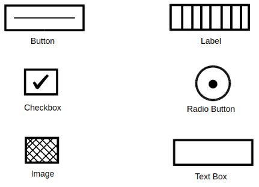
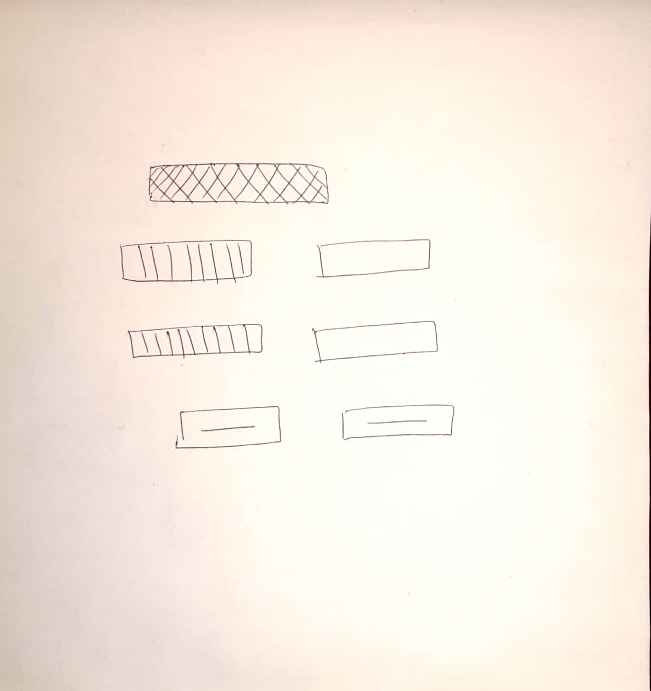

# HTML and CSS Generation from Hand-Drawn Sketches

[](https://github.com/RoshFps/HTML-and-CSS-Code-Generation-using-Image-Recognition/actions/workflows/ci.yml)


Draw a web form on paper, take a photo, and get a working HTML page back. A Faster R-CNN (ResNet-50) model trained on hand-drawn UI symbols detects each element. The elements are grouped into rows by position and turned into HTML, then styled with either a built-in stylesheet or CSS written by Google Gemini.



## How it works

```
photo ──► preprocess (resize 950×1000, dilate, Canny edges)
      ──► Faster R-CNN detection (TextBox, Label, Button, CheckBox, RadioButton, Image)
      ──► group element centres into rows (30 px tolerance), sort left→right
      ──► HTML generation ──► styling (default CSS or Gemini) ──► sandboxed preview
```

| Module | Responsibility |
| --- | --- |
| `app.py` | Flask web app: upload, run the pipeline, show results |
| `uploads.py` | Upload validation (type, size, real image check, re-encoding) |
| `preprocess.py` | OpenCV preprocessing |
| `main.py` | Model loading, inference, row grouping (also usable as a CLI) |
| `script_gen.py` | HTML generation |
| `css_gen.py` | Stylesheet generation and sanitising of AI output |
| `config.py` | All paths and settings, read from the environment |
| `create_record/` | Scripts to build TFRecords from labelled data |

## Setup

1. **Python environment**

   ```bash
   python -m venv .venv && source .venv/bin/activate
   pip install -r requirements.txt
   ```

2. **TensorFlow and the Object Detection API.** Install TensorFlow 1.15 (or TF 2.x, which the code uses through `tf.compat.v1`), then clone [tensorflow/models](https://github.com/tensorflow/models) and follow the [Object Detection API setup](https://github.com/tensorflow/models/tree/master/research/object_detection).

3. **Model.** Download `frozen_inference_graph_816.pb` from [this link](https://www.dropbox.com/sh/r7m3p0qikumtjuc/AABKP8kGBUzE8-pJo-WqGWD9a?dl=0).

4. **Configuration.** Copy `.env.example` to `.env` and set the paths:

   ```ini
   TF_MODELS_RESEARCH_DIR=/path/to/models/research
   MODEL_PATH=/path/to/frozen_inference_graph_816.pb
   GEMINI_API_KEY=            # optional
   ```

   You no longer need to replace `visualization_utils.py` inside the TensorFlow models repo, because the modified copy in this repository is imported directly.

## Usage

**Web app**

```bash
python app.py        # http://127.0.0.1:5000
```

Upload a photo. The result page shows the sketch, the detected elements, the raw HTML and the styled page, each downloadable.

**Command line**

```bash
python main.py new_test_imgs/test_imgs_2.jpg -o output/
```

## Security

- **Secrets:** API keys come from environment variables or a git-ignored `.env`, never from source code.
- **Uploads:** the extension is checked against an allow-list and the size is capped (default 8 MB). The file must decode as a PNG or JPEG, then it is re-encoded to strip metadata and payloads. It is saved under a fixed name in a random per-request directory, which prevents path traversal and stops one user's results from overwriting another's.
- **AI output:** CSS from Gemini is treated as untrusted. Markdown fences are extracted, anything that could close the `<style>` tag is removed, and `@import` is stripped. Generated pages are previewed in sandboxed iframes.
- **HTTP:** the app sends a Content Security Policy, `nosniff`, `Referrer-Policy` and frame-options headers. Debug mode is off unless `FLASK_DEBUG=1`, and the server binds to localhost.
- **CI:** unit tests, `bandit` and `gitleaks` secret scanning run on every push.

## Tests

```bash
pip install -r requirements-dev.txt
python -m unittest discover -s tests -t . -v
```

The tests cover upload validation (including path traversal and disguised files), HTML generation and CSS sanitising. They don't need TensorFlow.

## Example




## License

MIT, see [LICENSE](LICENSE).
